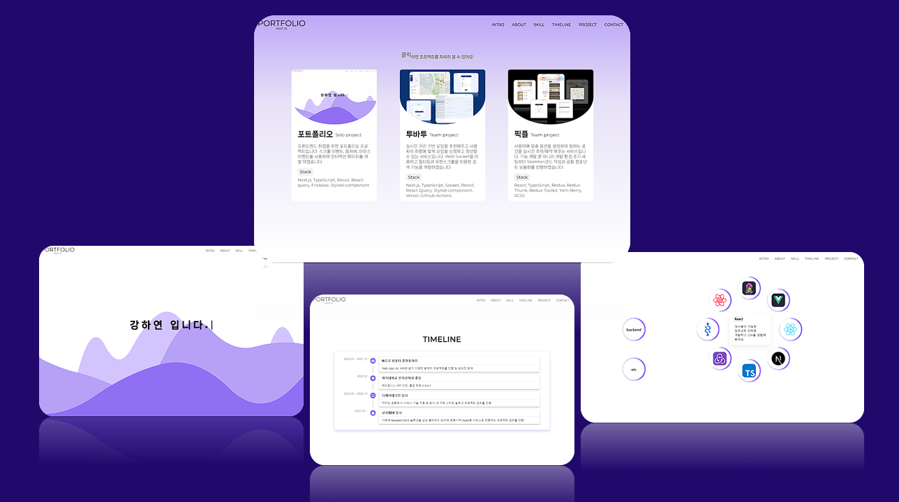

# Lydia-Portfolio

프론트엔드 개발자로서 역량 소개를 위한 포트폴리오 프로젝트입니다. 

 

## 서비스 설명

- 최소 기능 (MVP)
  - INTRO
  - ABOUT
  - SKILL
  - TIMELINE
  - PROJECT

- 적용 애니메이션
  - section간 스크롤 이동 구현
  - typing 동작 기능
  - mountain animation 구현
  - Intersection-Observer 연동
  - progress bar animation 기능
  - svg animation 기능

 

## Frontend

### ✨ 기술 설명
Next.js, TypeScript 를 이용해 Front-end 개발

### 🔥 기술 스택
> 사용 SPA 라이브러리 : Nextjs

|  **항목**  |     **기술 스택**    |
| ---------- | --------------------- |
| 환경세팅   | Next CNA              |
| 사용언어   | TypeScript            |
| 스타일링   | SCSS, MUI(emotion기반)|
| 상태관리   | Recoil, React Query   |
| 코드통합   | Prettier              |
| 에러검출   | Eslint                |
| API 통신   | Axios                 |
| API 모킹   | MSW                   |

### 🔅 코드 컨벤션
|  **항목**  |    **규칙**      |
| ---------- | ---------------- |
| Directory  | camelCase        |
| File       | PascalCase       |
| Constant   | SNAKE_CASE       |
| Variable   | camelCase        |
| Function   | camelCase        |

### ✔ 추가 라이브러리 & 버전 정보

|     **항목**     |  **버전 정보**    |
| ---------------- | ------------------ |
| Node             |  v18.17.0          |
| React            |  v18.2.0           |
| Next             |  v14.0.4           |
| Recoil           |  v0.7.7            |
| Axios            |  v1.4.0            |
| Sass             |  v1.69.6           |

 

---

🔗 [Lydia-Portfolio](https://www.lydia-portfolio.site)
